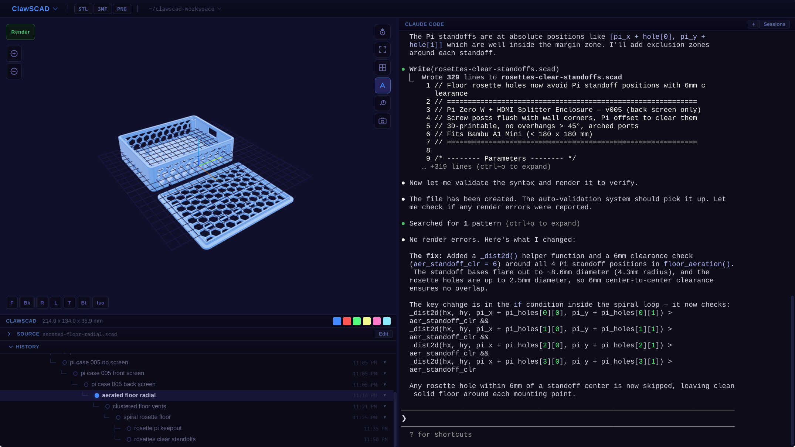

<p align="center">
  
</p>

<h1 align="center">ClawSCAD</h1>

<p align="center">
  <strong>AI-powered 3D CAD environment</strong><br>
  OpenSCAD + your coding agent with checkpoint branching, auto-iteration, and multi-viewport support
</p>

<p align="center">
  
</p>

---

## What is ClawSCAD?

ClawSCAD glues together [OpenSCAD](https://openscad.org/) and [Claude Code](https://github.com/anthropics/claude-code), [Codex](https://developers.openai.com/codex/cli), or [OpenCode](https://opencode.ai) in a single desktop application. Tell the agent what to build, and it writes OpenSCAD code, renders it, validates the output, and auto-iterates until the model is correct — all while you watch in a live 3D viewport.

Every iteration is saved as an immutable checkpoint. You can click any checkpoint to go back, branch from it, and explore different design directions. The agent sees your full history and can reference any previous version.

## Features

**3D Viewport**
- PBR rendering with environment-mapped reflections
- Orbit, pan, zoom (mouse + touch + keyboard)
- Wireframe, edge overlay, orthographic/perspective toggle
- 7 camera presets (Front/Back/Left/Right/Top/Bottom/Iso)
- Click any part to see dimensions, volume, weight, estimated print cost
- 6 customizable color swatches for instant model coloring
- Screenshot export
- Split viewport — open a second 3D view with independent camera

**Checkpoint History**
- Every .scad file is an immutable checkpoint in a branching tree
- Click any checkpoint to instantly load its model (cached in memory)
- Branch from any point — the agent creates new files, never overwrites
- Collapsible tree with box-drawing connectors
- Right-click context menu: rename, delete, collapse, view source, resume session
- Hover tooltips showing the change description

**Source Editor**
- Monaco editor with OpenSCAD syntax highlighting (Monarch grammar)
- Custom dark theme matching the app
- Find (Ctrl+F) and Replace (Ctrl+H)
- Read-only by default, toggle to edit mode
- OpenSCAD error markers (red squiggles on error lines)

**AI Agent Integration**
- Embedded terminal running Claude Code, Codex, or [OpenCode](https://opencode.ai) (select per workspace via the app menu)
- OpenSCAD MCP server auto-configured for every workspace (`.claude/settings.json` for Claude Code, per-launch configuration for Codex, and `opencode.json` for OpenCode)
- `CLAUDE.md` and a non-destructive managed block in `AGENTS.md` provide mandatory CAD workflow rules
- Vision-aware rules: when the active OpenCode model can't view images, ClawSCAD drops image-only MCP tools (render_single / render_perspectives) and tells the agent to verify programmatically
- Auto-iteration: when a render fails, ClawSCAD writes errors to RENDER_ERRORS.md and nudges the agent to fix them
- Session management: browse, resume, or start new sessions (Claude `--resume`, Codex `resume`, OpenCode `-s`)
- Dual terminal support (up to 2 instances)
- Multi-window support (up to 4 projects, agent sees all workspaces)

**Export**
- STL, 3MF, and PNG export buttons in the header
- 3MF export preserves per-part colors (when OpenSCAD supports it)
- Print cost estimation with configurable infill, material, and cost/kg

## Install

```bash
git clone https://github.com/levkropp/ClawSCAD.git
cd ClawSCAD
npm install
npm start
```

**Prerequisites:**
- [Node.js](https://nodejs.org/) 18+
- [OpenSCAD](https://openscad.org/downloads.html) installed and in PATH (or set `OPENSCAD_BINARY` env var)
- At least one supported agent CLI:
  - [Claude Code](https://github.com/anthropics/claude-code): `npm install -g @anthropic-ai/claude-code`
  - [Codex](https://developers.openai.com/codex/cli): `npm install -g @openai/codex`
  - [OpenCode](https://opencode.ai)

## Usage

1. Launch ClawSCAD — it creates a workspace at `~/clawscad-workspace/`
2. Choose an installed agent; it starts in the terminal panel on the right
3. Tell it what to build: *"Make a gear with 20 teeth and a shaft hole"*
4. The agent writes a .scad file, and ClawSCAD auto-renders it in the 3D viewport
5. If the render fails, ClawSCAD tells the agent to fix it automatically
6. Click any checkpoint in the History panel to go back and branch
7. Use the color swatches to try different colors instantly
8. Export to STL/3MF when you're happy with the design

## Keyboard Shortcuts

| Shortcut | Action |
|---|---|
| `Ctrl+N` | New viewport (split view) |
| `Ctrl+F` | Find in source editor |
| `Ctrl+H` | Find and replace |
| `F5` | Force re-render |
| `1`-`7` | Camera presets (when viewport focused) |
| `R` | Reset view |
| `F` | Zoom to fit |
| `W` | Toggle wireframe |
| `E` | Toggle edges |
| `O` | Toggle ortho/perspective |
| `+`/`-` | Zoom in/out |
| `Escape` | Deselect part |

## Architecture

```
ClawSCAD
├── main.js          Electron main process — multi-window, project state, render queue, MCP client
├── renderer.js      3D viewport (three.js), terminal (xterm.js), editor (Monaco), checkpoint tree
├── preload.js       IPC bridge between main and renderer
├── index.html       Layout
├── style.css        Dark theme
└── icon.png         App icon
```

- **Rendering**: OpenSCAD CLI (`openscad -o output.3mf input.scad`), tries 3MF first (preserves colors), falls back to STL
- **3D engine**: three.js with MeshStandardMaterial, RoomEnvironment, EdgesGeometry, raycaster picking
- **Terminal**: xterm.js + node-pty, spawns `claude`, `codex`, or `opencode` directly
- **Editor**: Monaco with custom Monarch grammar for OpenSCAD
- **MCP**: Spawns `openscad-mcp-server` as a JSON-RPC subprocess for direct render/validate access

## License

MIT — see [LICENSE](LICENSE).

OpenSCAD and each selected agent CLI are launched as separate subprocesses. ClawSCAD does not incorporate or link against them.
